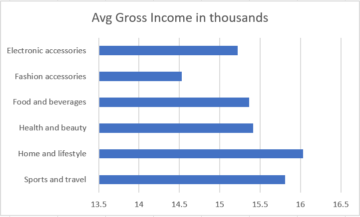

# Map-Reduce
- Learning the basics of ***MapReduce*** for large datasets in ***Python***.

## Data Description:
- This DataSet contains details of X-supermarket which has branches in different which tell about different tax percentage on different product ,mode of payments ,Quality rating .
- The Dataset is from open source [Kaggle](https://www.kaggle.com)

## Study:
- For this Dataset, I want to find out the avg gross income of each product type in from all the branches of the X-supermarket.

## Step for processing of data (Execution):
- A mapper file extracts the productType column data from the csv sheet , which is used as a key  and gross income for the  Values .This output is given as input to the Sorter File then  the ouput of sorter file is given to reducer File which inturn given as output to output.txt Used this data to visuallize

## Ps Command:
- ***cat supermarketsales.csv | python 21mapper.py | python 22sorter.py | python 23reducer.py > output.txt***

## Summary:
- By examing the data we can say Home and Lifestyle bar as highest avg gross income 16 thousand and Fashion Accessories product type as lowest avg grossincome 14.5 thousand and Food and beverages ,Health and beauty have almost equal avg gross income .

 

